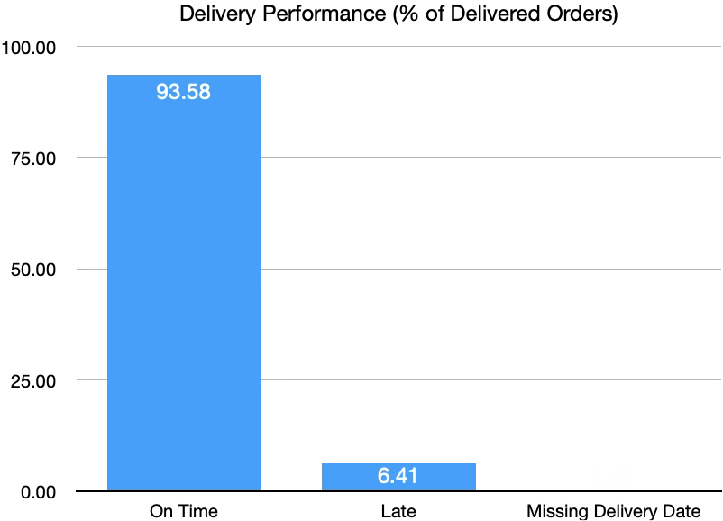
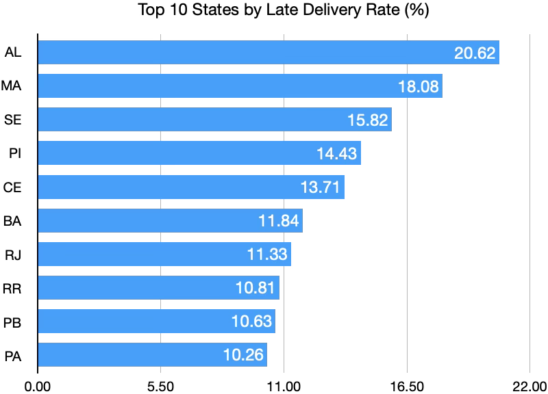
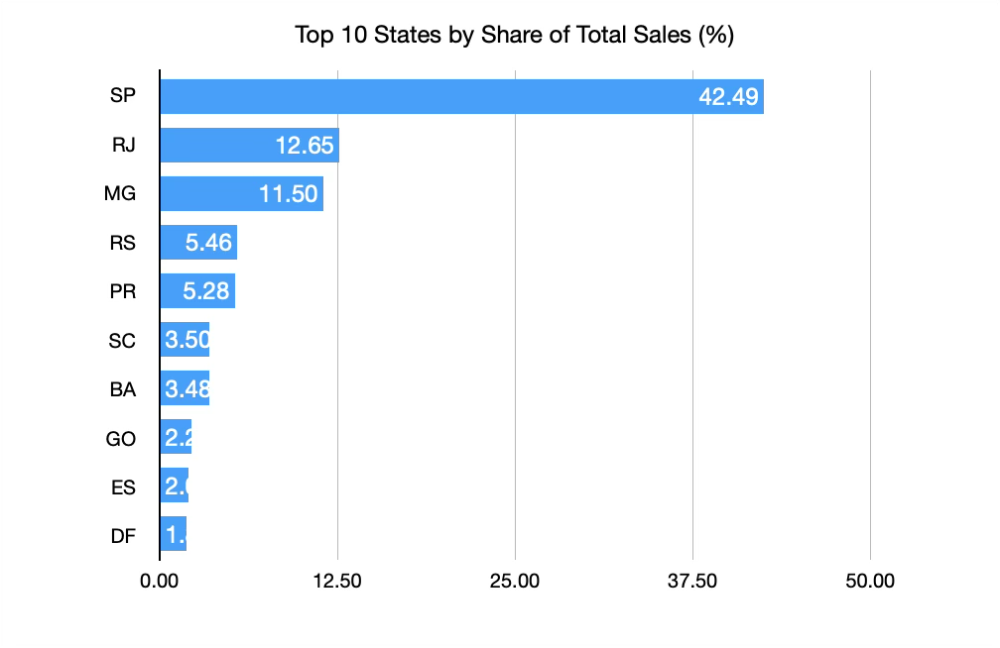
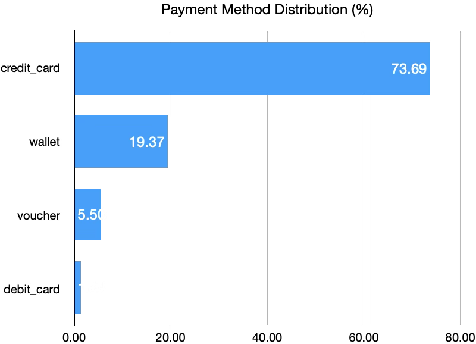

# E-Commerce Supply Chain SQL Analysis

## Project Overview

This project analyzes an e-commerce transactional dataset using PostgreSQL to evaluate order fulfillment, delivery performance, product characteristics, customer geography, sales, and payment behavior.

The goal was to use SQL to identify operational patterns and translate them into actionable business insights related to supply-chain performance.

## Business Questions

The analysis answers 15 business questions, including:

- What percentage of orders are successfully delivered?
- What is the average delivery time?
- What percentage of deliveries arrive on time?
- Which states experience the highest late-delivery rates?
- Are shipping charges associated with delivery delays?
- Are heavier products associated with late deliveries?
- Which product categories experience the highest late-delivery rates?
- Which product categories generate the most sales?
- Which payment methods are used most frequently?
- Which payment methods generate the highest transaction values?
- How does payment value vary by installment count?
- Which states generate the most sales?
- Which commercially important states also experience poor delivery performance?

## Data Quality & Preparation

Before performing the business analysis, several validation steps were completed:

- Compared row counts across source tables
- Tested primary-key uniqueness
- Identified duplicate product IDs
- Investigated whether duplicated product IDs contained conflicting attributes
- Created a deduplicated `products_clean` table
- Added a primary key to the cleaned product table
- Checked relationships between orders, order items, products, and payments
- Identified missing delivery timestamps and handled them separately in delivery analysis

## SQL Techniques Used

- `SELECT`, `WHERE`, and `ORDER BY`
- `GROUP BY`
- `COUNT`, `SUM`, and `AVG`
- `CASE WHEN`
- `INNER JOIN` and `LEFT JOIN`
- Subqueries
- Window functions
- `COUNT(DISTINCT ...)`
- Date and timestamp calculations
- Conditional aggregation
- Percentage calculations
- Data-quality validation

## Key Findings

- Average delivery time was approximately **12.43 days**.
- Approximately **93.58% of delivered orders arrived on time**.
- Product weight was higher on average among late deliveries than on-time deliveries.
- Credit cards represented approximately **73.69% of payment transactions**.
- Voucher transactions had the highest average payment value among the payment methods analyzed.
- São Paulo (SP) generated approximately **42.49% of total sales**, making it the largest market in the dataset.
- Rio de Janeiro (RJ) represented a significant fulfillment opportunity: it was the second-largest state by delivered-order sales while experiencing an approximately **11.33% late-delivery rate**, compared with approximately **4.24% in SP**.

## Analysis Visualizations

### Delivery Performance


### States with Highest Late Delivery Rates


### Geographic Sales Distribution


### Payment Method Distribution


## Business Recommendations

1. Prioritize investigation of fulfillment performance in high-value markets such as Rio de Janeiro, where sales volume is substantial but late-delivery rates are comparatively high.
2. Investigate logistics requirements for heavier products, which showed higher average weights among late deliveries.
3. Monitor product categories with elevated late-delivery rates to identify category-specific fulfillment constraints.
4. Use geographic sales and delivery metrics together when prioritizing logistics improvements rather than focusing only on delay percentages.
5. Consider payment-method behavior when evaluating customer purchasing patterns and transaction value.

## Dataset Limitation

The product data showed a substantial concentration in the `toys` category. Because this category represented a disproportionately large share of unique products and sales in the supplied dataset, category-level results should be interpreted as characteristics of this dataset rather than as general e-commerce market trends.

## Repository Structure

```text
ecommerce-supply-chain-sql-analysis/
├── README.md
├── sql/
│   ├── 01_data_quality.sql
│   └── 02_business_analysis.sql
└── images/
```

## Tools

- PostgreSQL
- DBeaver
- SQL
- GitHub
